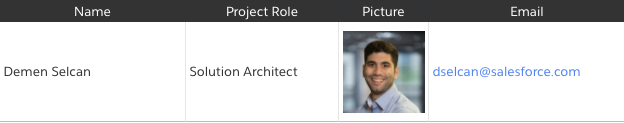
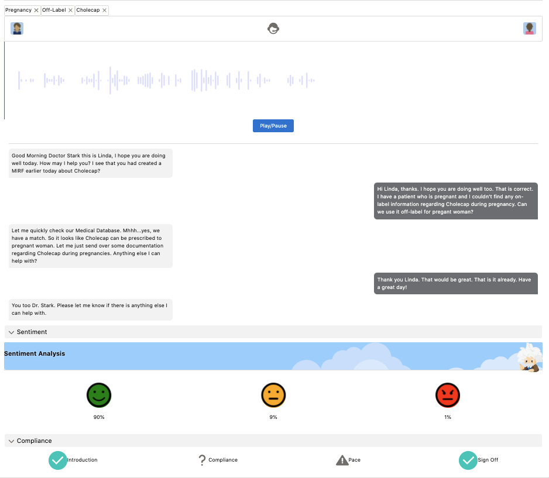
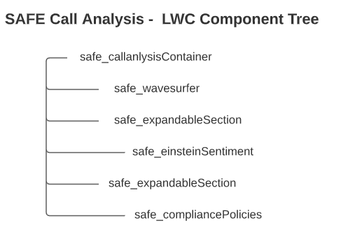

## SAFE Call Analysis: SOUND, ANALYSIS, FEELING Demo Component

SAFE Call Analysis is a Demo Component which mocks a call coaching/analysis component. You can upload, visualize and play fictive conversations between a call center agent and a client e.g. Doctor or Patient.

This helps showing how conceptual audio transcriptions and sentiment analysises can be conducted with Einstein Voice or Einstein Call Coaching for example.

Best of all - it is completely configurable via the Lightning Page Layout Builder without the need to change a single line of code.

Check out the documentation for more Information. Looking forward to your feedback.

Demen - dselcan@salesforce.com

## Documentation

[Documentation](https://salesforce.quip.com/7u94AvL9C816 "Documentation")


### Team




### SAFE - Call Analytics in Action



#### Component Tree



### Deploy this to your Org

<a href="https://githubsfdeploy.herokuapp.com?owner=CoreSEs&repo=safe_callanalysis">
  
</a>

### Installing it via SFDX

```shell
sfdx force:source:push --forceoverwrite --loglevel fatal --wait 30
```

